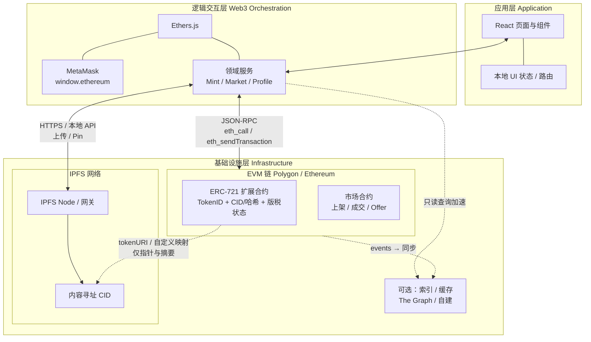
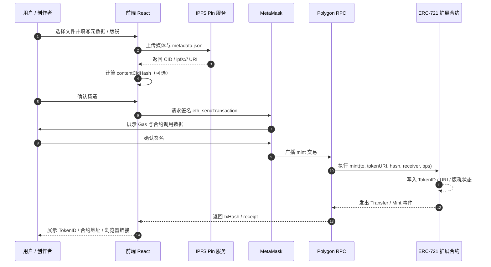
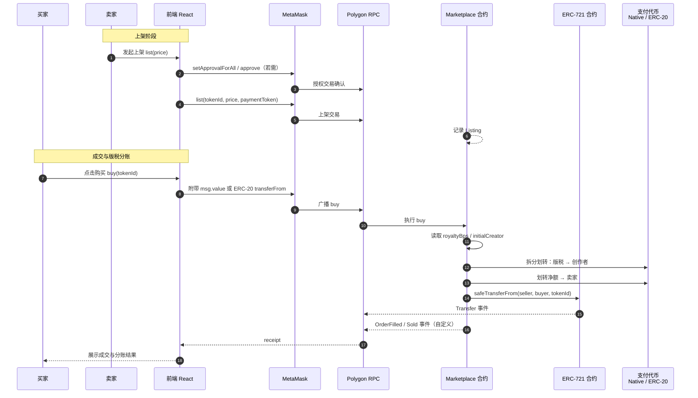

# 系统架构设计说明书

**项目名称**：基于区块链的数字资产确权与流通系统（AssetChain）  
**文档版本**：V1.0  
**编制单位**：西南交通大学 · 第13组（高校优秀实践项目）  
**文档类型**：系统架构设计（SAD / Architecture Design Document）

---

## 1. 系统总体架构（System Architecture）

### 1.1 设计理念

AssetChain 面向 **可验证确权** 与 **可编程流通** 两类核心价值，在工程上遵循以下原则：

| 原则 | 技术内涵 | 架构落点 |
|------|----------|----------|
| **去中心化** | 业务规则由链上合约执行，不依赖单一平台数据库作为最终真相源 | 资产权属、交易结算、版税分账以合约为准；前端与索引服务仅作呈现与加速 |
| **透明性** | 状态迁移与价值分配可被任意审计方复算 | 事件日志（Events）完整 emitted；关键参数（`tokenId`、受益人、版税基点）上链可读 |
| **低 Gas 消耗** | 链上仅保留必要状态与计算，避免将大对象写入合约存储 | **链上链下分离**：媒体与元数据置于 IPFS，链上仅存 **TokenID ↔ 内容指纹（CID 或哈希）** 映射；复杂检索链下完成 |

在上述约束下，系统采用 **EVM 链（Ethereum / Polygon）+ IPFS** 的双栈基础设施：Polygon 作为主业务部署网络时可显著降低单笔交互的 Gas 成本（相对以太坊主网），同时保持与 **Ethers.js / MetaMask** 工具链的完全兼容。

### 1.2 逻辑分层架构图解说

系统自顶向下划分为 **应用层（Presentation）**、**逻辑交互层（Web3 & Orchestration）**、**基础设施层（Chain & Storage）**。各层职责与交互边界如下。

#### 1.2.1 分层职责

- **应用层（React + TailwindCSS）**  
  负责路由、页面布局、表单校验、列表与详情展示、交易状态机 UI（Pending / Confirmed / Failed）。**禁止**在本层持久化私钥；不将 IPFS 原始二进制经链上路径传输。

- **逻辑交互层（Ethers.js + MetaMask）**  
  封装 `Provider`（只读 RPC）、`Signer`（用户授权写链）、合约实例绑定（ABI + 地址）、事件订阅与交易回执轮询。对上提供领域级 API（如 `mintAsset`、`listForSale`、`fulfillOffer`），对下屏蔽 RPC 细节与链 ID 切换。

- **基础设施层**  
  - **EVM 链**：部署 ERC-721 扩展合约与市场/分账合约；持久化 Token 状态、订单/出价状态、版税参数。  
  - **IPFS**：持久化媒体文件与 `tokenURI` 指向的 JSON 元数据；通过 **CID** 与链上映射关联。  
  - **可选链下索引**：The Graph、自建索引器或缓存服务，用于市场列表与溯源时间轴聚合，**不改变**链上最终语义。

#### 1.2.2 逻辑分层架构图（Mermaid）



**边界说明**：应用层仅通过逻辑交互层访问链与 IPFS；合约层不直接发起 HTTP 请求；IPFS 与链的 **唯一耦合点** 为合约存储中的 **CID 或其对内容的密码学承诺（哈希）** 及 `tokenURI` 策略（见第 2.2 节）。

---

## 2. 核心模块技术设计（Core Module Design）

### 2.1 智能合约架构设计

#### 2.1.1 设计目标与标准对齐

- **基线标准**：ERC-721（`ownerOf`、`safeTransferFrom`、`Transfer` 事件等）。  
- **版税与分润**：在兼容 OpenSea / 市场生态的前提下，可采用 **EIP-2981** 式 `royaltyInfo(tokenId, salePrice)` 只读接口供外部聚合；**强制分润** 则必须在 **本系统市场合约的成交路径** 或 **带钩子（hook）的转账路径** 中实现，因标准 `transfer` 本身不包含价款语义。  
- **教学与答辩表述**：在 ERC-721 基础上 **扩展资产状态**（初始创作者地址、版税基点 `royaltyBps`、可选 `contentHash`），并在 **交易结算函数**（而非裸 `transfer`）内完成价款拆分与版税划转；若采用 **可编程 NFT（如 ERC-721 扩展 + 受限转移）**，需在文档与代码中明确 **与钱包原生“发送 NFT”行为的差异**，避免用户预期偏差。

#### 2.1.2 推荐合约拆分（关注点分离）

| 合约模块 | 职责 | 与数据分离的关系 |
|----------|------|------------------|
| **AssetRegistry / AssetNFT** | `mint`、元数据 URI、每 Token 的 **CID 或内容哈希**、创作者与版税参数 | 仅存储 **指针与摘要**，不存储文件本体 |
| **Marketplace** | `list`、`buy`（一口价）、`createOffer`、`acceptOffer`、`cancel` | 在 `buy` / `accept` 中原子完成：对价转移、NFT 交割、**版税与卖家净额分账** |
| **（可选）RoyaltyEngine** | 统一解析版税受益人与基点，便于升级 | 降低主 NFT 合约复杂度 |

#### 2.1.3 状态变量设计（示意）

以下为逻辑字段设计，具体命名以实现仓库为准。

**NFT 合约（每 `tokenId` 或全局默认值 + 每 Token 覆盖）**

| 状态 | 类型建议 | 说明 |
|------|----------|------|
| `contentCidHash` | `bytes32` | **IPFS CIDv0/v1 的规范化哈希** 或对 `tokenURI` 内容的 commitment，用于链上校验与防篡改锚定（若仅存 URI 字符串则 Gas 较高，可权衡存哈希 + 链下披露 CID） |
| `initialCreator` | `address` | 铸造时锁定的版税受益人 |
| `royaltyBps` | `uint96` | 版税基点（如 100 = 1%，上限如 10000） |
| `tokenURI` | `string` 或链下解析 | 指向 IPFS 上 JSON 元数据 |

**市场合约**

| 状态 | 说明 |
|------|------|
| `listing[tokenId]` | 卖家、标价、支付代币（原生或 ERC-20） |
| `offers[tokenId][buyer]` | 出价金额、过期时间、是否有效 |

#### 2.1.4 核心接口定义（示意）

**铸造**

```solidity
// 语义示意，非最终代码
function mint(
    address to,
    string calldata tokenURI_,
    bytes32 contentCidHash,
    address royaltyReceiver,
    uint96 royaltyBps
) external returns (uint256 tokenId);
```

**市场：一口价与 Offer**

```solidity
function list(uint256 tokenId, uint256 price, address paymentToken) external;
function buy(uint256 tokenId) external payable; // 或 ERC-20 版本
function createOffer(uint256 tokenId, uint256 price, uint256 deadline) external payable;
function acceptOffer(uint256 tokenId, address buyer) external;
function cancelListing(uint256 tokenId) external;
```

**版税分账**：在 `buy` / `acceptOffer` 内部按 `price * royaltyBps / 10000` 计算版税，分别 `transfer` 至 `royaltyReceiver` 与卖家地址；剩余逻辑处理平台费（若有）。使用 **Checks-Effects-Interactions** 与 **重入锁** 保证外部调用安全（见第 4.1 节）。

---

### 2.2 存储架构设计（IPFS 与 Polygon 的数据指针关联逻辑）

#### 2.2.1 链上链下分离机制（重点）

区块链存储以 **32 字节槽** 为单位的成本远高于 IPFS 侧对象存储。AssetChain 采用如下关联策略：

1. **大文件（高清图、音频、模型等）** 仅上传至 **IPFS**，得到 **CID**（内容标识）。  
2. **链上** 在铸造时持久化：  
   - **`tokenId`**；  
   - **`contentCidHash`**（对规范化 CID 字符串或原始 multihash 的 `keccak256` 等承诺），或在与 Gas 权衡后存储 **短指针 + 链下注册表**；  
   - **`tokenURI`**：通常形如 `ipfs://<CID>/metadata.json`，由钱包与浏览器通过网关解析。  
3. **验证逻辑**：前端或审计方可从 IPFS 取回文件，重算哈希并与链上 `contentCidHash` 比对，证明 **链上 Token 与链下内容** 的绑定关系。

该机制在经济学上分离 **“昂贵的共识状态”** 与 **“廉价的冗余 blob 存储”**，在语义上保留 **可验证确权锚点**。

#### 2.2.2 元数据 JSON 建议结构（链下）

```json
{
  "name": "string",
  "description": "string",
  "image": "ipfs://...",
  "attributes": [],
  "properties": { "cid": "bafy...", "mime": "image/png" }
}
```

`image` 字段指向媒体 CID；链上 `contentCidHash` 可与媒体或元数据之一对齐，项目需在实现中 **固定一种规范** 并在 README 中说明。

#### 2.2.3 Polygon 与 IPFS 的协同

- **Polygon**：承担 **状态转换** 与 **价值转移** 的最终性。  
- **IPFS**：承担 **大对象持久化**；通过 **Pinning 服务**（NFT.Storage、Web3.Storage、自建节点）降低 GC 导致的 **内容不可用** 风险（见第 4.3 节）。

---

### 2.3 前端状态管理与 Web3 交互（Ethers.js Provider / Signer 机制）

#### 2.3.1 Provider 与 Signer 分离

| 对象 | 来源 | 用途 |
|------|------|------|
| **BrowserProvider**（v6）或 **Web3Provider**（v5） | `new ethers.BrowserProvider(window.ethereum)` | 只读：`eth_call`、`getBlock`、`readContract` |
| **Signer** | `provider.getSigner()` | 写链：`sendTransaction`、`contract.connect(signer).mint(...)` |

**约束**：全局单例 Provider 与 **当前 Signer 地址** 必须在 React Context（或等价状态库）中同步；监听 `accountsChanged` 与 `chainChanged`，防止 UI 展示地址与签名主体不一致。

#### 2.3.2 与合约、IPFS 的调用拓扑

- **读路径**：列表页优先走索引或批量 `multicall`；详情页 `ownerOf`、`tokenURI`、市场 `listing`。  
- **写路径**：用户操作 → 组装交易 → MetaMask 弹窗 → 广播 → `wait(1)` 或轮询回执 → 失效本地缓存并重新拉取。  
- **IPFS 写路径**：文件 → 前端/后端 API → Pin 服务 → 返回 CID → 再触发链上 `mint`（顺序必须 **先 IPFS 后链上**，避免产生 **无指针的 Token**）。

---

## 3. 核心业务数据流转（Data Flow & Sequence）

### 3.1 资产铸造（Mint）时序流转说明

**流程摘要**：本地选文件 → 上传 IPFS（媒体 + 元数据）→ 得到 CID / `tokenURI` → 用户确认版税与元数据 → 调用 NFT 合约 `mint` → 交易确认 → 前端展示 `tokenId` 与区块浏览器链接。



**架构要点**：CID 与元数据在链确认前已存在于 IPFS；链上交易失败不会回滚已 Pin 的对象，因此可实现 **“预上传 + 延迟 mint”** 的垃圾回收策略（教学项目可选）。

---

### 3.2 资产二级市场交易（买卖与版税分发）时序流转说明

**流程摘要**：卖家授权市场合约操作 NFT → `list` → 买家调用 `buy` 或路径 `acceptOffer` → 市场合约在同一原子事务中完成：**对价入账拆分（版税 / 卖家 / 可选平台费）** + **NFT 转移**。



**自动化版税分发架构（重点）**：版税不在每次 `transfer` 中隐含实现（因无价款），而在 **市场成交函数** 内基于 **成交价格** 计算并划转；NFT 合约持久化 **每 Token 的 `royaltyBps` 与受益人**，市场合约通过只读调用或事件同步获得参数，保证 **二级市场任意成交价** 下分润逻辑一致且可审计。

---

## 4. 非功能性架构设计（NFR Architecture）

### 4.1 安全架构

| 维度 | 措施 |
|------|------|
| **重入攻击** | 市场合约对含外部调用的函数使用 **ReentrancyGuard**；严格遵循 **CEI** 模式；对 ERC-721 的 `onERC721Received` 回调路径重点审计。 |
| **溢出与类型安全** | Solidity `^0.8.x` 内置算术检查；版税与价格使用 **统一精度**（如 Wei 与 BPS）。 |
| **权限与授权** | 最小化 `approve` 范围；优先 `setApprovalForAll` 仅对 **可信市场合约地址**；支持用户撤销授权。 |
| **前端安全** | 合约地址白名单 + `chainId` 校验；防范恶意 `approve` 钓鱼；依赖锁定与构建完整性。 |
| **常态化监测** | 对关键合约订阅 `Paused`、`OwnershipTransferred`、`ListingCreated` 等事件；RPC 层告警异常调用量；Slither / Mythril 纳入 CI（与 SRS 安全需求对齐）。 |

### 4.2 性能与成本优化（Gas 与计算分离）

| 策略 | 说明 |
|------|------|
| **存储压缩** | 能用 `uint96` / `bytes32` 则不使用长动态字符串；长 `tokenURI` 可采用 **链下注册表 + 链上短键** 降低首次 mint Gas。 |
| **计算与验证分离** | 复杂排序、搜索、多条件筛选由 **索引层** 完成；链上仅保留 **单 Token 成交必要校验**（价格、过期、授权、余额）。 |
| **批量只读** | 使用 Multicall3 聚合 `ownerOf`、`tokenURI`，减少 RTT。 |
| **Polygon 特性利用** | 在相同 opcode 成本模型下，通过 **降低交互次数**（合并状态更新）获得更优端到端费用；注意 **网络拥堵** 时仍可能升高。 |

### 4.3 高可用与持久性（IPFS 与平滑演进）

| 主题 | 架构做法 |
|------|----------|
| **IPFS 冗余** | 多 Pinning 提供商、多副本；记录 **Pin 状态** 与 CID 列表；关键对象 **内容寻址不变性** 保证迁移时只需换网关。 |
| **网关容灾** | 前端配置 **网关列表**（公共网关 + 自建网关），失败自动轮换；对 `ipfs://` 统一解析层封装。 |
| **底层存储平滑过渡** | 链上锚定 **内容哈希** 而非单一网关 URL；从 IPFS 迁移至 Arweave / 混合方案时，只要 **哈希一致或提供可验证迁移证明**，前端解析层可透明切换。 |
| **链上最终性** | UI 层对 Pending 状态做明确反馈；关键读操作在交易确认后 **强制刷新** 避免陈旧 `ownerOf`。 |

---

## 5. 文档修订记录

| 版本 | 日期 | 修订说明 | 作者 |
|------|------|----------|------|
| V1.0 | 2026-05-05 | 初稿：分层架构、合约与 IPFS 关联、Mint/交易时序、NFR | 第13组 |

---

**附录**：实现阶段建议补充 **部署拓扑图**（合约地址表、`chainId`、RPC 与 Pin 服务端点）、**ABI 版本管理与升级策略**（不可升级则强调部署不可变性与审计快照），以及与《软件需求规格说明书》之间的 **需求-架构追踪矩阵**。
